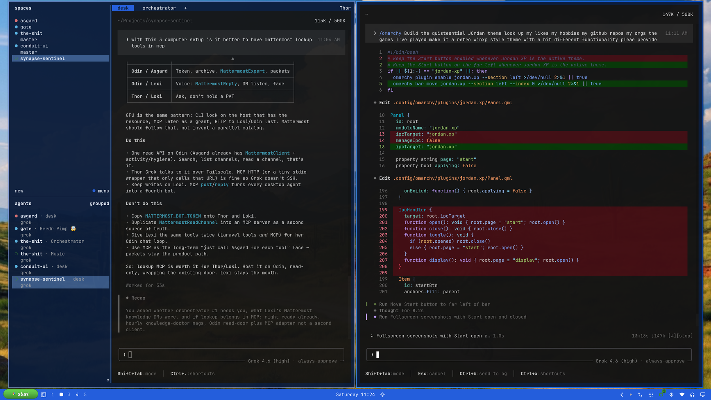

# omarchy-rice

Thor's [Omarchy](https://omarchy.org/) overlay. Jordan OS is the house on the glass; XP is a costume.

Live files stay in `~/.config` (Omarchy reads them there). This repo is the git home.

The older [`dotfiles`](https://github.com/jordanpartridge/dotfiles) tree is chezmoi for Nobara/macOS. Do not mix the two.



## What's in it

| Path | What |
|---|---|
| `config/omarchy/themes/` | `jordan-os`, `jordan-xp`, `mudhawk`, `skull`, `the-shit`, `no-worktrees` |
| `cmd/magic/` | Go spellbook (`magic` / `noworktrees`) |
| `config/omarchy/plugins/` | Cabinet, gadgets, weather, tailscale, github-orgs, bar widgets, music |
| `config/omarchy/hooks/` | Theme-set, post-boot gadgets, Stream Deck, voxtype |
| `config/omarchy/branding/` | Screensaver + about (webcam capture stays on the machine) |
| `config/hypr/` | Bindings, window rules, Thor monitor layout |
| `config/{ghostty,alacritty,kitty,foot}/` | 15pt JetBrainsMono; colors still come from the active theme |

Not vendored: [BlueFerry](https://github.com/erikwb/omarchy-blueferry) (clone it). Webcam screensaver. `*.bak*` and Omarchy `.sample` hooks.

## Magic

Spellbook for this rice. Same dusk as the jump wallpaper: banner magenta, sun gold, **NO WORKTREES**.

```bash
make install          # ~/.local/bin/magic  and  noworktrees
magic                 # crouch, launch, land — this is the product
magic poster          # fatbike in the terminal
noworktrees           # plant the theme, then jump
```

`make test` is plain Go. It does not need a Hypr worktree, a vendor dir, or the daily clone. Full clone or don't.

## Install

On an Omarchy box:

```bash
git clone https://github.com/jordanpartridge/omarchy-rice.git
cd omarchy-rice
./scripts/install.sh          # skip Thor's dual-LG monitors.lua
./scripts/install.sh --thor   # this machine is Thor
omarchy theme set jordan-os
omarchy restart shell
hyprctl reload
```

`install.sh` overlays files. It does not run `omarchy theme set`.

## Snapshot (Thor)

After a rice change on the desk:

```bash
./scripts/snapshot.sh
git add -A && git status
```

## Bindings

| Keys | Action |
|---|---|
| Super+Shift+A | Grok Build |
| Super+Shift+I | iMessage (BlueFerry) |
| Super+Shift+Ctrl+O | Toggle local AI (Ollama stays up) |
| Super+Shift+G | GitHub orgs glance |
| Super+Ctrl+J | Omarchy root menu |
| Super+Ctrl+U | Jordan OS floating clock |
| Super+M | Music cabinet |

## Jordan OS

Cabinet desktop. Start is sleeve / now-playing, night-shift, Elon. Footer keys switch eras (Mac · 95 · XP · DOS) without resetting packets.

```
jordan-os                         # show options
jordan-os era mac|95|xp|dos
jordan-os room bliss|dirt|gold|night|soundtrack
```

Unlock copy: **Biker, not cyclist**.

## License

MIT
